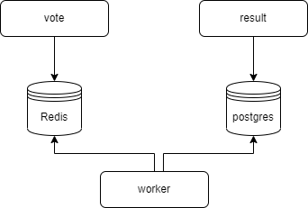

# Practise Docker and Docker Swarm
## zebra-unicorn voting app

### Purpose:
The purpose of this project is just to practise some Docker and Docker Swarm commands/functionality.

### The name:
The name comes from the start up universe, where we have unicorns start ups, companies that reach 1 billion dollar of market value, and zebras start ups, companies that are dedicated to balance both profit and purpose.
More info of Zebras companies you can find [here](https://zebrasunite.mn.co/).

### Architecture:

### Functionality and Stack
- The functionality of the app is just for to choice which kind of thinking do you identify the most: Zebras or Unicorn.
- The services were building with Kotlin, Spring boot, Gradle and others libs.
- The vote-app receive the vote and store on Redis. The worker-app read the data from Redis with simple scheduler that run in each 3secs and store it in Postgres. The result-app show the ranking result getting it from Postgres.
- The Redis and Postgres containers are made of official images.
- Interfaces for voting and viewing the result are provided for the Swagger Interface.

### How build and run:
For run locally we need to run `./gradlew build` in each app folder(vote/worker/result) before run `docker-compose up -d`, or in the root of the projet just run `./run.sh`

For run with Swarm, active it by running in the terminal: `docker swarm init`.  
The images used in the docker-stack are publics in docker.hub. Then execute the command below in terminal to run stack:  
`docker stack deploy --compose-file docker-stack.yml zebra-unicorn-app`

### How to access the apps locally:
Vote, [here](http://localhost:8080/api/swagger-ui.html). Result, [here](http://localhost:8081/api/swagger-ui.html).  
Visualizer, an interface for look the docker nodes in Docker Swarm is provided [here](http://localhost:8083)

